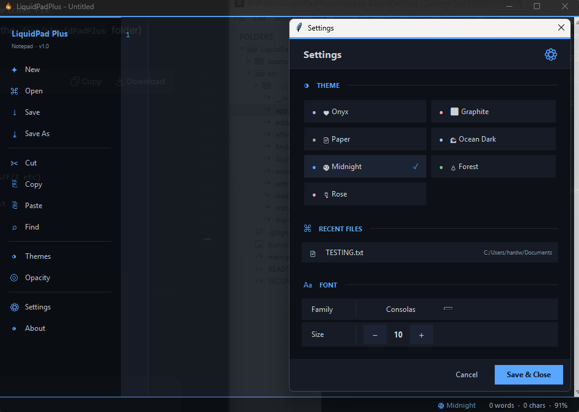

# 💧 LiquidPadPlus

**A fast, beautiful, transparent notepad for Windows.**

LiquidPadPlus is a fork of [LiquidPad](https://github.com/PremiumBabyShark/LiquidPad) focused on enhanced UI, theming, and professional editing features. Built with Python + Tkinter. Zero dependencies.



---

## ✨ Features

- ☰ **Retractable Sidebar** — Press TAB or click ☰ in status bar to toggle
- 💾 **Session Restore** — Automatically reopens your last file
- 🏷️ **Modified Indicator** — Shows when file has unsaved changes
- 📍 **Live Cursor Position** — Line and column display in status bar
- 🪟 **Transparency Control** — Adjustable window opacity (30%–100%)
- 💎 **Glass Morphism** — Frosted glass effects on select themes
- 🎨 **7 Themes** — Onyx, Graphite, Paper, Ocean Dark, Midnight, Forest, Rose
- 📝 **Line Numbers** — Dynamic gutter with auto-expanding width
- 🔍 **Find & Replace** — Smart search with contrast-safe highlights
- 🎛️ **macOS-style Settings** — Animated toggle switches
- 🔤 **Font Picker** — Choose from all installed monospace fonts
- ⚙️ **Settings Persistence** — JSON-based, remembers everything between sessions
- 📂 **Recent Files** — Quick access to last 5 opened files
- 💬 **Tooltips** — Hover over status bar items for help
- 📌 **Always on Top** — Pin above other windows
- 🌙 **Dark Title Bar** — Native Windows dark mode title bar
- ⚡ **Instant Startup** — Optimized for speed
- 📦 **~20MB RAM** — Lightweight and efficient

---

## ⌨️ Keyboard Shortcuts

| Shortcut | Action |
|----------|--------|
| `TAB` | Toggle sidebar |
| `Ctrl+N` | New file |
| `Ctrl+O` | Open file |
| `Ctrl+S` | Save |
| `Ctrl+Shift+S` | Save As |
| `Ctrl+F` | Find & Replace |
| `Ctrl+Z` | Undo |
| `Ctrl+Y` | Redo |
| `Ctrl+X/C/V` | Cut/Copy/Paste |
| `Ctrl+A` | Select All |
| `Ctrl+Q` | Exit |
| `Ctrl+Scroll` | Zoom text |

---

## 🎨 Themes

| Theme | Style | Glass Effect |
|-------|-------|:---:|
| 🖤 Onyx | Dark glass | ✅ |
| ⬛ Graphite | Solid dark | ❌ |
| 📄 Paper | Warm light | ❌ |
| 🌊 Ocean Dark | Blue glass | ✅ |
| 🌑 Midnight | GitHub dark | ❌ |
| 🌲 Forest | Green dark | ❌ |
| 🌹 Rose | Pink glass | ✅ |

---

## 📈 Stats
⭐ 157+ unique cloners in first two weeks

👁️ 350+ total clones

🔴 Featured on Reddit

---

## 🙏 Credits
Original LiquidPad

Fork by PremiumBabyShark

Built with Python + Tkinter

---

## 📄 License
MIT — free for personal and commercial use.

---

## 🚀 Installation

### Windows Installer (Recommended)
Download the latest setup from [Releases](https://github.com/PremiumBabyShark/LiquidPadPlus/releases/latest).

### Portable Version
Download `LiquidPadPlus_v1.2.zip` from [Releases](https://github.com/PremiumBabyShark/LiquidPadPlus/releases/latest) and extract anywhere.

### Run from Source
```bash
git clone https://github.com/PremiumBabyShark/LiquidPadPlus.git
cd LiquidPadPlus
python main.py
